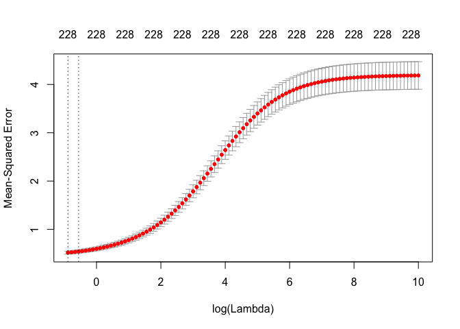
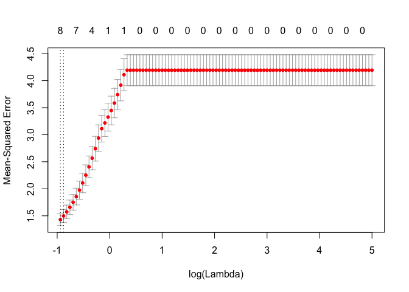

P8106 HW 1
================

### (a) Fit a linear model using least squares on the training data and calculate the mean square error using the test data.

Fit a linear model

``` r
# Fit model using train data
fit1 = lm(Solubility ~ ., data = train)
summary(fit1)
```

    ## 
    ## Call:
    ## lm(formula = Solubility ~ ., data = train)
    ## 
    ## Residuals:
    ##      Min       1Q   Median       3Q      Max 
    ## -1.75620 -0.28304  0.01165  0.30030  1.54887 
    ## 
    ## Coefficients:
    ##                     Estimate Std. Error t value Pr(>|t|)    
    ## (Intercept)        2.431e+00  2.162e+00   1.124 0.261303    
    ## FP001              3.594e-01  3.185e-01   1.128 0.259635    
    ## FP002              1.456e-01  2.637e-01   0.552 0.580960    
    ## FP003             -3.969e-02  1.314e-01  -0.302 0.762617    
    ## FP004             -3.049e-01  1.371e-01  -2.223 0.026520 *  
    ## FP005              2.837e+00  9.598e-01   2.956 0.003223 ** 
    ## FP006             -6.886e-02  2.041e-01  -0.337 0.735917    
    ## FP007              4.044e-02  1.152e-01   0.351 0.725643    
    ## FP008              1.121e-01  1.636e-01   0.685 0.493331    
    ## FP009             -8.242e-01  8.395e-01  -0.982 0.326536    
    ## FP010              4.193e-01  3.136e-01   1.337 0.181579    
    ## FP011              5.158e-02  2.198e-01   0.235 0.814503    
    ## FP012             -1.346e-02  1.611e-01  -0.084 0.933452    
    ## FP013             -4.519e-01  5.473e-01  -0.826 0.409311    
    ## FP014              3.281e-01  4.550e-01   0.721 0.471044    
    ## FP015             -1.839e-01  1.521e-01  -1.209 0.226971    
    ## FP016             -1.367e-01  1.548e-01  -0.883 0.377340    
    ## FP017             -1.704e-01  1.386e-01  -1.230 0.219187    
    ## FP018             -3.824e-01  2.388e-01  -1.602 0.109655    
    ## FP019             -3.131e-01  3.863e-01  -0.811 0.417862    
    ## FP020              2.072e-01  2.135e-01   0.971 0.332078    
    ## FP021             -5.956e-02  2.632e-01  -0.226 0.821060    
    ## FP022              2.336e-01  3.456e-01   0.676 0.499180    
    ## FP023             -3.193e-01  1.909e-01  -1.672 0.094866 .  
    ## FP024             -4.272e-01  2.827e-01  -1.511 0.131162    
    ## FP025              4.376e-01  4.538e-01   0.964 0.335184    
    ## FP026              2.068e-01  2.564e-01   0.806 0.420273    
    ## FP027              2.424e-01  2.429e-01   0.998 0.318594    
    ## FP028              1.070e-01  1.200e-01   0.892 0.372547    
    ## FP029             -9.857e-02  2.199e-01  -0.448 0.654163    
    ## FP030             -2.361e-01  2.468e-01  -0.957 0.339048    
    ## FP031              8.690e-02  1.346e-01   0.646 0.518754    
    ## FP032             -1.204e+00  7.772e-01  -1.550 0.121628    
    ## FP033              5.766e-01  4.236e-01   1.361 0.173882    
    ## FP034             -1.794e-01  2.618e-01  -0.685 0.493486    
    ## FP035             -2.140e-01  1.704e-01  -1.256 0.209605    
    ## FP036              7.701e-02  1.657e-01   0.465 0.642133    
    ## FP037              1.098e-01  1.725e-01   0.636 0.524693    
    ## FP038              2.721e-01  1.888e-01   1.441 0.150030    
    ## FP039              2.011e-02  2.888e-01   0.070 0.944491    
    ## FP040              5.477e-01  1.890e-01   2.898 0.003873 ** 
    ## FP041             -4.265e-01  3.004e-01  -1.420 0.156143    
    ## FP042             -9.901e-01  7.078e-01  -1.399 0.162294    
    ## FP043             -3.725e-02  2.096e-01  -0.178 0.859011    
    ## FP044             -3.860e-01  2.184e-01  -1.768 0.077562 .  
    ## FP045              2.120e-01  1.299e-01   1.631 0.103238    
    ## FP046             -3.504e-02  2.733e-01  -0.128 0.898010    
    ## FP047             -1.675e-02  1.414e-01  -0.118 0.905775    
    ## FP048              2.610e-01  2.434e-01   1.073 0.283810    
    ## FP049              1.241e-01  1.971e-01   0.630 0.529036    
    ## FP050              9.087e-03  1.410e-01   0.064 0.948648    
    ## FP051              1.050e-01  2.014e-01   0.521 0.602210    
    ## FP052             -4.569e-01  2.482e-01  -1.841 0.066029 .  
    ## FP053              2.994e-01  2.466e-01   1.214 0.225129    
    ## FP054              2.734e-02  1.829e-01   0.149 0.881229    
    ## FP055             -3.662e-01  1.970e-01  -1.858 0.063530 .  
    ## FP056             -2.961e-01  2.979e-01  -0.994 0.320541    
    ## FP057             -1.002e-01  1.379e-01  -0.727 0.467703    
    ## FP058              3.100e-01  8.074e-01   0.384 0.701129    
    ## FP059             -1.615e-01  1.690e-01  -0.956 0.339514    
    ## FP060              2.350e-01  1.474e-01   1.595 0.111209    
    ## FP061             -6.365e-01  1.440e-01  -4.421 1.13e-05 ***
    ## FP062             -5.224e-01  2.961e-01  -1.764 0.078078 .  
    ## FP063             -2.001e+00  1.287e+00  -1.554 0.120553    
    ## FP064              2.549e-01  1.221e-01   2.087 0.037207 *  
    ## FP065             -2.844e-01  1.197e-01  -2.377 0.017714 *  
    ## FP066              2.093e-01  1.264e-01   1.655 0.098301 .  
    ## FP067             -1.406e-01  1.540e-01  -0.913 0.361631    
    ## FP068              4.964e-01  2.028e-01   2.447 0.014630 *  
    ## FP069              1.324e-01  8.824e-02   1.501 0.133885    
    ## FP070              3.453e-03  8.088e-02   0.043 0.965963    
    ## FP071              1.474e-01  1.237e-01   1.192 0.233775    
    ## FP072             -9.773e-01  2.763e-01  -3.537 0.000431 ***
    ## FP073             -4.671e-01  2.072e-01  -2.254 0.024474 *  
    ## FP074              1.793e-01  1.206e-01   1.487 0.137566    
    ## FP075              1.231e-01  1.035e-01   1.188 0.235034    
    ## FP076              5.166e-01  1.704e-01   3.031 0.002525 ** 
    ## FP077              1.644e-01  1.236e-01   1.331 0.183739    
    ## FP078             -3.715e-01  1.588e-01  -2.339 0.019608 *  
    ## FP079              4.254e-01  1.881e-01   2.262 0.023992 *  
    ## FP080              3.101e-01  1.554e-01   1.996 0.046340 *  
    ## FP081             -3.208e-01  1.117e-01  -2.873 0.004192 ** 
    ## FP082              1.243e-01  9.524e-02   1.305 0.192379    
    ## FP083             -6.916e-01  2.134e-01  -3.241 0.001248 ** 
    ## FP084              3.626e-01  2.381e-01   1.523 0.128171    
    ## FP085             -3.310e-01  1.428e-01  -2.317 0.020785 *  
    ## FP086              1.169e-02  9.774e-02   0.120 0.904834    
    ## FP087              4.559e-02  2.797e-01   0.163 0.870568    
    ## FP088              2.416e-01  9.959e-02   2.425 0.015534 *  
    ## FP089              5.999e-01  2.320e-01   2.586 0.009915 ** 
    ## FP090             -2.450e-02  1.154e-01  -0.212 0.831930    
    ## FP091             -2.858e-01  3.185e-01  -0.897 0.369847    
    ## FP092              2.665e-01  2.069e-01   1.288 0.198156    
    ## FP093              1.974e-01  1.087e-01   1.816 0.069803 .  
    ## FP094             -1.991e-01  1.441e-01  -1.381 0.167707    
    ## FP095             -1.403e-01  1.124e-01  -1.248 0.212449    
    ## FP096             -5.024e-01  1.459e-01  -3.445 0.000605 ***
    ## FP097             -2.635e-01  1.666e-01  -1.582 0.114020    
    ## FP098             -2.865e-01  1.633e-01  -1.754 0.079863 .  
    ## FP099              2.592e-01  2.568e-01   1.009 0.313136    
    ## FP100             -4.008e-01  3.034e-01  -1.321 0.186949    
    ## FP101             -1.760e-01  3.019e-01  -0.583 0.560147    
    ## FP102              2.445e-01  3.449e-01   0.709 0.478579    
    ## FP103             -1.493e-01  9.148e-02  -1.632 0.103176    
    ## FP104             -1.428e-01  1.176e-01  -1.214 0.225238    
    ## FP105             -6.912e-02  1.395e-01  -0.495 0.620482    
    ## FP106              1.128e-01  1.288e-01   0.876 0.381495    
    ## FP107              2.778e+00  8.247e-01   3.369 0.000796 ***
    ## FP108              8.836e-03  1.852e-01   0.048 0.961970    
    ## FP109              8.200e-01  2.267e-01   3.617 0.000319 ***
    ## FP110              3.680e-01  3.311e-01   1.111 0.266811    
    ## FP111             -5.565e-01  1.420e-01  -3.918 9.80e-05 ***
    ## FP112             -1.079e-01  2.705e-01  -0.399 0.690108    
    ## FP113              1.511e-01  9.481e-02   1.594 0.111478    
    ## FP114             -1.201e-01  1.891e-01  -0.635 0.525628    
    ## FP115             -1.896e-01  1.405e-01  -1.349 0.177736    
    ## FP116              7.778e-03  1.897e-01   0.041 0.967300    
    ## FP117              2.583e-01  1.779e-01   1.452 0.147070    
    ## FP118             -1.964e-01  1.230e-01  -1.596 0.110940    
    ## FP119              7.515e-01  2.630e-01   2.857 0.004402 ** 
    ## FP120             -1.814e-01  1.794e-01  -1.011 0.312362    
    ## FP121             -4.731e-02  3.957e-01  -0.120 0.904866    
    ## FP122              1.048e-01  1.041e-01   1.007 0.314268    
    ## FP123              3.926e-02  1.765e-01   0.222 0.824066    
    ## FP124              1.235e-01  1.705e-01   0.724 0.469243    
    ## FP125             -2.633e-04  1.151e-01  -0.002 0.998175    
    ## FP126             -2.782e-01  1.177e-01  -2.363 0.018373 *  
    ## FP127             -6.123e-01  1.739e-01  -3.521 0.000457 ***
    ## FP128             -5.424e-01  1.932e-01  -2.807 0.005136 ** 
    ## FP129             -6.731e-02  2.243e-01  -0.300 0.764167    
    ## FP130             -1.034e+00  4.106e-01  -2.518 0.012009 *  
    ## FP131              2.158e-01  1.617e-01   1.335 0.182405    
    ## FP132             -1.976e-01  2.382e-01  -0.830 0.406998    
    ## FP133             -1.573e-01  1.217e-01  -1.293 0.196319    
    ## FP134              2.496e+00  1.196e+00   2.086 0.037310 *  
    ## FP135              1.818e-01  1.319e-01   1.379 0.168460    
    ## FP136             -7.763e-02  3.131e-01  -0.248 0.804237    
    ## FP137             -4.613e-02  2.978e-01  -0.155 0.876947    
    ## FP138             -9.392e-02  1.906e-01  -0.493 0.622251    
    ## FP139              7.659e-02  4.063e-01   0.189 0.850517    
    ## FP140              3.145e-01  2.149e-01   1.463 0.143784    
    ## FP141              2.219e-01  2.765e-01   0.802 0.422532    
    ## FP142              6.272e-01  1.488e-01   4.214 2.83e-05 ***
    ## FP143              9.981e-01  2.929e-01   3.407 0.000692 ***
    ## FP144              2.207e-01  2.839e-01   0.777 0.437195    
    ## FP145             -1.146e-01  1.188e-01  -0.964 0.335169    
    ## FP146             -2.324e-01  2.086e-01  -1.114 0.265716    
    ## FP147              1.502e-01  1.228e-01   1.223 0.221703    
    ## FP148             -1.600e-01  1.319e-01  -1.213 0.225560    
    ## FP149              1.172e-01  1.650e-01   0.710 0.477770    
    ## FP150              9.046e-02  1.577e-01   0.574 0.566368    
    ## FP151              2.899e-01  3.120e-01   0.929 0.353202    
    ## FP152             -2.544e-01  2.990e-01  -0.851 0.395087    
    ## FP153             -3.765e-01  2.773e-01  -1.358 0.175029    
    ## FP154             -1.027e+00  2.033e-01  -5.054 5.50e-07 ***
    ## FP155              4.888e-01  2.916e-01   1.676 0.094163 .  
    ## FP156             -3.602e-02  3.636e-01  -0.099 0.921109    
    ## FP157             -4.715e-01  2.468e-01  -1.910 0.056505 .  
    ## FP158              1.669e-02  1.925e-01   0.087 0.930943    
    ## FP159              1.800e-01  2.432e-01   0.740 0.459378    
    ## FP160              1.525e-02  2.177e-01   0.070 0.944155    
    ## FP161             -2.440e-01  1.433e-01  -1.703 0.089063 .  
    ## FP162              4.910e-02  1.859e-01   0.264 0.791710    
    ## FP163              4.785e-01  3.121e-01   1.533 0.125659    
    ## FP164              5.096e-01  1.899e-01   2.684 0.007446 ** 
    ## FP165              5.793e-01  2.146e-01   2.700 0.007103 ** 
    ## FP166             -6.582e-02  2.185e-01  -0.301 0.763293    
    ## FP167             -6.044e-01  2.515e-01  -2.403 0.016502 *  
    ## FP168             -1.187e-01  1.872e-01  -0.634 0.526173    
    ## FP169             -1.705e-01  8.312e-02  -2.051 0.040650 *  
    ## FP170             -7.902e-02  1.560e-01  -0.506 0.612745    
    ## FP171              4.651e-01  1.186e-01   3.922 9.64e-05 ***
    ## FP172             -4.426e-01  2.440e-01  -1.814 0.070120 .  
    ## FP173              4.243e-01  1.657e-01   2.561 0.010634 *  
    ## FP174             -1.010e-01  2.098e-01  -0.481 0.630311    
    ## FP175             -4.657e-02  2.481e-01  -0.188 0.851136    
    ## FP176              9.736e-01  2.644e-01   3.682 0.000249 ***
    ## FP177              1.386e-01  2.393e-01   0.579 0.562538    
    ## FP178              6.497e-02  2.079e-01   0.313 0.754691    
    ## FP179             -3.415e-02  2.232e-01  -0.153 0.878437    
    ## FP180             -7.905e-01  5.523e-01  -1.431 0.152839    
    ## FP181              4.925e-01  3.218e-01   1.531 0.126309    
    ## FP182             -1.124e-01  1.310e-01  -0.858 0.391384    
    ## FP183              2.998e-01  7.143e-01   0.420 0.674836    
    ## FP184              4.876e-01  1.580e-01   3.087 0.002103 ** 
    ## FP185             -3.778e-01  2.037e-01  -1.854 0.064108 .  
    ## FP186             -3.654e-01  1.953e-01  -1.871 0.061710 .  
    ## FP187              4.457e-01  2.682e-01   1.662 0.097015 .  
    ## FP188              1.475e-01  1.258e-01   1.172 0.241519    
    ## FP189             -1.984e-02  3.468e-01  -0.057 0.954384    
    ## FP190              2.629e-01  3.018e-01   0.871 0.383981    
    ## FP191              2.799e-01  1.465e-01   1.911 0.056388 .  
    ## FP192             -2.404e-01  2.751e-01  -0.874 0.382534    
    ## FP193              1.502e-01  1.494e-01   1.005 0.315159    
    ## FP194              8.029e-01  6.379e-01   1.259 0.208566    
    ## FP195              5.967e-02  3.435e-01   0.174 0.862158    
    ## FP196              1.091e-02  2.544e-01   0.043 0.965812    
    ## FP197             -3.736e-02  1.569e-01  -0.238 0.811793    
    ## FP198              1.896e-01  2.665e-01   0.712 0.476893    
    ## FP199             -9.932e-02  1.797e-01  -0.553 0.580702    
    ## FP200             -6.421e-02  2.161e-01  -0.297 0.766462    
    ## FP201             -4.838e-01  1.980e-01  -2.444 0.014771 *  
    ## FP202              5.664e-01  1.869e-01   3.031 0.002527 ** 
    ## FP203              2.586e-01  6.447e-01   0.401 0.688462    
    ## FP204             -1.371e-01  2.543e-01  -0.539 0.590008    
    ## FP205              7.177e-02  1.561e-01   0.460 0.645857    
    ## FP206             -6.769e-02  1.860e-01  -0.364 0.716094    
    ## FP207             -5.538e-03  2.060e-01  -0.027 0.978560    
    ## FP208             -5.338e-01  6.324e-01  -0.844 0.398925    
    ## MolWeight         -1.232e+00  2.296e-01  -5.365 1.09e-07 ***
    ## NumAtoms          -1.478e+01  3.473e+00  -4.257 2.35e-05 ***
    ## NumNonHAtoms       1.795e+01  3.166e+00   5.670 2.07e-08 ***
    ## NumBonds           9.843e+00  2.681e+00   3.671 0.000260 ***
    ## NumNonHBonds      -1.030e+01  1.793e+00  -5.746 1.35e-08 ***
    ## NumMultBonds       2.107e-01  1.754e-01   1.201 0.229990    
    ## NumRotBonds       -5.213e-01  1.334e-01  -3.908 0.000102 ***
    ## NumDblBonds       -7.492e-01  3.163e-01  -2.369 0.018111 *  
    ## NumAromaticBonds  -2.364e+00  6.232e-01  -3.794 0.000161 ***
    ## NumHydrogen        8.347e-01  1.880e-01   4.439 1.04e-05 ***
    ## NumCarbon          1.730e-02  3.763e-01   0.046 0.963335    
    ## NumNitrogen        6.125e+00  3.045e+00   2.011 0.044645 *  
    ## NumOxygen          2.389e+00  4.523e-01   5.283 1.69e-07 ***
    ## NumSulfer         -8.508e+00  3.619e+00  -2.351 0.018994 *  
    ## NumChlorine       -7.449e+00  1.989e+00  -3.744 0.000195 ***
    ## NumHalogen         1.408e+00  2.109e+00   0.668 0.504615    
    ## NumRings           1.276e+00  6.716e-01   1.901 0.057731 .  
    ## HydrophilicFactor  1.099e-02  1.137e-01   0.097 0.922998    
    ## SurfaceArea1       8.825e-02  6.058e-02   1.457 0.145643    
    ## SurfaceArea2       9.555e-02  5.615e-02   1.702 0.089208 .  
    ## ---
    ## Signif. codes:  0 '***' 0.001 '**' 0.01 '*' 0.05 '.' 0.1 ' ' 1
    ## 
    ## Residual standard error: 0.5524 on 722 degrees of freedom
    ## Multiple R-squared:  0.9446, Adjusted R-squared:  0.9271 
    ## F-statistic: 54.03 on 228 and 722 DF,  p-value: < 2.2e-16

MSE

``` r
# MSE using test data
pred_va <- predict(fit1, test)
# validation set error
mean((pred_va-test$Solubility)^2)
```

    ## [1] 0.5558898

### (b) Fit a ridge regression model on the training data, with λ chosen by cross-validation. Report the test error.

Fit a ridge regression model

``` r
train <- na.omit(train)

x_train <- model.matrix(Solubility~., train)[,-1]
y_train <- train$Solubility

x_test <- model.matrix(Solubility~., test)[,-1]
y_test <- test$Solubility
```

``` r
# fit the ridge regression (alpha = 0) with a sequence of lambdas
ridge.mod <- glmnet(x_train, y_train, alpha=0, lambda = exp(seq(-1, 10, length=100)))
```

``` r
set.seed(1)
cv.ridge <- cv.glmnet(x_train, y_train, 
                      alpha = 0, 
                      lambda = exp(seq(-1, 10, length=100)), 
                      type.measure = "mse")

plot(cv.ridge)
```



``` r
best.lambda <- cv.ridge$lambda.min
best.lambda
```

    ## [1] 0.4111123

``` r
predict(ridge.mod, s = best.lambda, type="coefficients")
```

    ## 229 x 1 sparse Matrix of class "dgCMatrix"
    ##                              1
    ## (Intercept)        5.968322849
    ## FP001              0.040353876
    ## FP002              0.079270995
    ## FP003             -0.041000709
    ## FP004             -0.046630401
    ## FP005             -0.035744720
    ## FP006             -0.025180252
    ## FP007              0.040899610
    ## FP008              0.007465462
    ## FP009             -0.066005138
    ## FP010              0.018335289
    ## FP011              0.104689330
    ## FP012             -0.034483735
    ## FP013             -0.079183075
    ## FP014             -0.024848831
    ## FP015              0.037490375
    ## FP016             -0.083413245
    ## FP017             -0.132413623
    ## FP018             -0.083700569
    ## FP019              0.064342538
    ## FP020              0.080015222
    ## FP021             -0.032107169
    ## FP022              0.125311700
    ## FP023             -0.104016552
    ## FP024             -0.025494218
    ## FP025             -0.017526762
    ## FP026              0.141751128
    ## FP027              0.155896990
    ## FP028              0.069742288
    ## FP029             -0.053871373
    ## FP030             -0.086951129
    ## FP031              0.184263264
    ## FP032             -0.024191596
    ## FP033              0.174075141
    ## FP034             -0.152741112
    ## FP035             -0.051215764
    ## FP036             -0.022904633
    ## FP037              0.233803728
    ## FP038              0.062519375
    ## FP039             -0.351090484
    ## FP040              0.381810962
    ## FP041              0.024689921
    ## FP042              0.074639199
    ## FP043              0.140498976
    ## FP044             -0.410589955
    ## FP045              0.029987276
    ## FP046              0.093222228
    ## FP047             -0.044654791
    ## FP048             -0.029711525
    ## FP049              0.250117310
    ## FP050             -0.084552402
    ## FP051             -0.034926707
    ## FP052             -0.001729912
    ## FP053              0.246628453
    ## FP054             -0.084630027
    ## FP055             -0.033582290
    ## FP056             -0.136071527
    ## FP057             -0.075843586
    ## FP058              0.038354558
    ## FP059             -0.359828377
    ## FP060              0.100923486
    ## FP061             -0.021869939
    ## FP062              0.073999367
    ## FP063              0.182657359
    ## FP064              0.073041361
    ## FP065             -0.143786424
    ## FP066              0.114103064
    ## FP067             -0.041153386
    ## FP068              0.028196136
    ## FP069              0.096601599
    ## FP070             -0.237122045
    ## FP071              0.027973360
    ## FP072              0.290230245
    ## FP073              0.024721480
    ## FP074              0.157954476
    ## FP075              0.185388296
    ## FP076             -0.114414201
    ## FP077              0.051370755
    ## FP078              0.007332078
    ## FP079              0.061327859
    ## FP080              0.078982956
    ## FP081             -0.116901148
    ## FP082              0.001343448
    ## FP083             -0.137080041
    ## FP084              0.173371419
    ## FP085             -0.208279181
    ## FP086             -0.054551750
    ## FP087             -0.010054691
    ## FP088              0.120262020
    ## FP089             -0.211280416
    ## FP090             -0.009566666
    ## FP091              0.043646209
    ## FP092             -0.064588101
    ## FP093              0.041092428
    ## FP094             -0.067602434
    ## FP095              0.044081217
    ## FP096              0.092295071
    ## FP097              0.055388464
    ## FP098             -0.027785530
    ## FP099              0.053207347
    ## FP100             -0.032407638
    ## FP101              0.131862209
    ## FP102              0.094763414
    ## FP103             -0.108361989
    ## FP104             -0.119844785
    ## FP105             -0.059215136
    ## FP106             -0.054048569
    ## FP107             -0.067266341
    ## FP108              0.011533903
    ## FP109              0.118414433
    ## FP110             -0.016196220
    ## FP111             -0.289384061
    ## FP112             -0.094904612
    ## FP113              0.045897583
    ## FP114              0.061534714
    ## FP115              0.125696353
    ## FP116              0.162910735
    ## FP117             -0.116823702
    ## FP118             -0.061595506
    ## FP119              0.081285411
    ## FP120              0.005581167
    ## FP121             -0.030475962
    ## FP122              0.160510535
    ## FP123             -0.100859659
    ## FP124              0.205530243
    ## FP125              0.083358637
    ## FP126             -0.236725643
    ## FP127             -0.179671642
    ## FP128             -0.135553869
    ## FP129              0.059233646
    ## FP130             -0.088565455
    ## FP131              0.179046316
    ## FP132              0.009925420
    ## FP133             -0.065956664
    ## FP134             -0.128298415
    ## FP135              0.178275951
    ## FP136              0.124403707
    ## FP137              0.099756172
    ## FP138              0.149176487
    ## FP139              0.064549801
    ## FP140              0.014790809
    ## FP141             -0.174709255
    ## FP142              0.287510951
    ## FP143              0.171051091
    ## FP144              0.022514568
    ## FP145             -0.189150494
    ## FP146             -0.114268846
    ## FP147              0.222634960
    ## FP148              0.042965259
    ## FP149             -0.065915214
    ## FP150              0.065311922
    ## FP151              0.133396697
    ## FP152             -0.077609080
    ## FP153             -0.050078864
    ## FP154             -0.234622342
    ## FP155              0.067017381
    ## FP156             -0.109632866
    ## FP157              0.089305241
    ## FP158             -0.037786724
    ## FP159              0.188226318
    ## FP160             -0.088848145
    ## FP161             -0.003271111
    ## FP162              0.055213340
    ## FP163              0.152425392
    ## FP164              0.135341792
    ## FP165             -0.064469122
    ## FP166              0.127964451
    ## FP167             -0.054038777
    ## FP168             -0.136061672
    ## FP169             -0.137788257
    ## FP170              0.071797496
    ## FP171              0.106442380
    ## FP172             -0.219047080
    ## FP173              0.200711378
    ## FP174             -0.021470454
    ## FP175             -0.062524321
    ## FP176              0.208062122
    ## FP177             -0.068098143
    ## FP178             -0.070375657
    ## FP179              0.099506811
    ## FP180             -0.063677978
    ## FP181              0.029687485
    ## FP182             -0.021692216
    ## FP183              0.018470211
    ## FP184              0.128718070
    ## FP185             -0.023396072
    ## FP186             -0.097930288
    ## FP187              0.058137959
    ## FP188              0.240284519
    ## FP189              0.061403509
    ## FP190              0.150140336
    ## FP191              0.037606560
    ## FP192              0.047537178
    ## FP193             -0.149799259
    ## FP194              0.056635410
    ## FP195              0.002924591
    ## FP196              0.050001952
    ## FP197             -0.005495174
    ## FP198              0.141584096
    ## FP199             -0.056593677
    ## FP200             -0.072399231
    ## FP201             -0.146990800
    ## FP202              0.164109581
    ## FP203              0.057885645
    ## FP204             -0.109802197
    ## FP205             -0.121112383
    ## FP206             -0.193791599
    ## FP207              0.042011442
    ## FP208              0.024783144
    ## MolWeight         -0.829590816
    ## NumAtoms          -0.358624413
    ## NumNonHAtoms      -0.547568367
    ## NumBonds          -0.324416586
    ## NumNonHBonds      -0.269166311
    ## NumMultBonds      -0.071975591
    ## NumRotBonds       -0.148355944
    ## NumDblBonds       -0.045770083
    ## NumAromaticBonds  -0.076640522
    ## NumHydrogen        0.027945338
    ## NumCarbon         -0.213144670
    ## NumNitrogen        0.301614717
    ## NumOxygen          0.235965460
    ## NumSulfer         -0.447098297
    ## NumChlorine       -0.488270356
    ## NumHalogen        -0.425367090
    ## NumRings          -0.195145696
    ## HydrophilicFactor  0.128935633
    ## SurfaceArea1       0.052824225
    ## SurfaceArea2       0.035275858

MSE

``` r
ridge.pred = predict(ridge.mod, s = best.lambda, newx = x_test)
mean((ridge.pred - y_test)^2)
```

    ## [1] 0.5518668

### (c) Fit a lasso model on the training data, with λ chosen by cross-validation. Report the test error, along with the number of non-zero coefficient estimates.

Fit a lasso model

``` r
lasso.mod <- glmnet(x_train, y_train, alpha=1, lambda = exp(seq(-1, 5, length=100)))
```

``` r
set.seed(1)
cv.lasso <- cv.glmnet(x_train, y_train, alpha = 1, lambda = exp(seq(-1, 5, length=100)))
best.lambda <- cv.lasso$lambda.min
```

``` r
plot(cv.lasso)
```



The number of non-zero coefficient estimates

``` r
lasso_coef = predict(cv.lasso, s="lambda.min", type="coefficients")
lasso_coef
```

    ## 229 x 1 sparse Matrix of class "dgCMatrix"
    ##                             1
    ## (Intercept)        6.75424495
    ## FP001              .         
    ## FP002              .         
    ## FP003              .         
    ## FP004              .         
    ## FP005              .         
    ## FP006              .         
    ## FP007              .         
    ## FP008              .         
    ## FP009              .         
    ## FP010              .         
    ## FP011              .         
    ## FP012              .         
    ## FP013              .         
    ## FP014              .         
    ## FP015              .         
    ## FP016              .         
    ## FP017              .         
    ## FP018              .         
    ## FP019              .         
    ## FP020              .         
    ## FP021              .         
    ## FP022              .         
    ## FP023              .         
    ## FP024              .         
    ## FP025              .         
    ## FP026              .         
    ## FP027              .         
    ## FP028              .         
    ## FP029              .         
    ## FP030              .         
    ## FP031              .         
    ## FP032              .         
    ## FP033              .         
    ## FP034              .         
    ## FP035              .         
    ## FP036              .         
    ## FP037              .         
    ## FP038              .         
    ## FP039              .         
    ## FP040              .         
    ## FP041              .         
    ## FP042              .         
    ## FP043              .         
    ## FP044             -0.74440459
    ## FP045              .         
    ## FP046              .         
    ## FP047              .         
    ## FP048              .         
    ## FP049              .         
    ## FP050              .         
    ## FP051              .         
    ## FP052              .         
    ## FP053              .         
    ## FP054              .         
    ## FP055              .         
    ## FP056              .         
    ## FP057              .         
    ## FP058              .         
    ## FP059              .         
    ## FP060              .         
    ## FP061              .         
    ## FP062              .         
    ## FP063              .         
    ## FP064              .         
    ## FP065              .         
    ## FP066              .         
    ## FP067              .         
    ## FP068              .         
    ## FP069              .         
    ## FP070              .         
    ## FP071              .         
    ## FP072              0.06708760
    ## FP073              .         
    ## FP074              .         
    ## FP075              .         
    ## FP076              .         
    ## FP077              .         
    ## FP078              .         
    ## FP079              .         
    ## FP080              .         
    ## FP081              .         
    ## FP082              .         
    ## FP083              .         
    ## FP084              .         
    ## FP085              .         
    ## FP086              .         
    ## FP087              .         
    ## FP088              .         
    ## FP089             -0.11821518
    ## FP090              .         
    ## FP091              .         
    ## FP092              .         
    ## FP093              .         
    ## FP094              .         
    ## FP095              .         
    ## FP096              .         
    ## FP097              .         
    ## FP098              .         
    ## FP099              .         
    ## FP100              .         
    ## FP101              .         
    ## FP102              .         
    ## FP103              .         
    ## FP104              .         
    ## FP105              .         
    ## FP106              .         
    ## FP107              .         
    ## FP108              .         
    ## FP109              .         
    ## FP110              .         
    ## FP111              .         
    ## FP112              .         
    ## FP113              .         
    ## FP114              .         
    ## FP115              .         
    ## FP116              .         
    ## FP117              .         
    ## FP118              .         
    ## FP119              .         
    ## FP120              .         
    ## FP121              .         
    ## FP122              .         
    ## FP123              .         
    ## FP124              .         
    ## FP125              .         
    ## FP126              .         
    ## FP127              .         
    ## FP128              .         
    ## FP129              .         
    ## FP130              .         
    ## FP131              .         
    ## FP132              .         
    ## FP133              .         
    ## FP134              .         
    ## FP135              .         
    ## FP136              .         
    ## FP137              .         
    ## FP138              .         
    ## FP139              .         
    ## FP140              .         
    ## FP141              .         
    ## FP142              .         
    ## FP143              .         
    ## FP144              .         
    ## FP145              .         
    ## FP146              .         
    ## FP147              .         
    ## FP148              .         
    ## FP149              .         
    ## FP150              .         
    ## FP151              .         
    ## FP152              .         
    ## FP153              .         
    ## FP154              .         
    ## FP155              .         
    ## FP156              .         
    ## FP157              .         
    ## FP158              .         
    ## FP159              .         
    ## FP160              .         
    ## FP161              .         
    ## FP162              .         
    ## FP163              .         
    ## FP164              .         
    ## FP165              .         
    ## FP166              .         
    ## FP167              .         
    ## FP168              .         
    ## FP169              .         
    ## FP170              .         
    ## FP171              .         
    ## FP172             -0.09922031
    ## FP173              .         
    ## FP174              .         
    ## FP175              .         
    ## FP176              .         
    ## FP177              .         
    ## FP178              .         
    ## FP179              .         
    ## FP180              .         
    ## FP181              .         
    ## FP182              .         
    ## FP183              .         
    ## FP184              .         
    ## FP185              .         
    ## FP186              .         
    ## FP187              .         
    ## FP188              .         
    ## FP189              .         
    ## FP190              .         
    ## FP191              .         
    ## FP192              .         
    ## FP193              .         
    ## FP194              .         
    ## FP195              .         
    ## FP196              .         
    ## FP197              .         
    ## FP198              .         
    ## FP199              .         
    ## FP200              .         
    ## FP201              .         
    ## FP202              .         
    ## FP203              .         
    ## FP204              .         
    ## FP205              .         
    ## FP206              .         
    ## FP207              .         
    ## FP208              .         
    ## MolWeight         -1.74822244
    ## NumAtoms           .         
    ## NumNonHAtoms       .         
    ## NumBonds           .         
    ## NumNonHBonds       .         
    ## NumMultBonds       .         
    ## NumRotBonds        .         
    ## NumDblBonds        .         
    ## NumAromaticBonds   .         
    ## NumHydrogen        .         
    ## NumCarbon         -0.25534026
    ## NumNitrogen        .         
    ## NumOxygen          .         
    ## NumSulfer          .         
    ## NumChlorine        .         
    ## NumHalogen         .         
    ## NumRings           .         
    ## HydrophilicFactor  0.12318782
    ## SurfaceArea1       0.08429721
    ## SurfaceArea2       .

``` r
lasso_coef[lasso_coef != 0] # Display only non-zero coefficients
```

    ## <sparse>[ <logic> ] : .M.sub.i.logical() maybe inefficient

    ## [1]  6.75424495 -0.74440459  0.06708760 -0.11821518 -0.09922031 -1.74822244
    ## [7] -0.25534026  0.12318782  0.08429721

The number of non-zero coefficient is 9.

MSE

``` r
lasso.pred = predict(lasso.mod, s=best.lambda, newx = x_test)
mean((lasso.pred - y_test)^2)
```

    ## [1] 1.389214

#### (d) Fit a PCR model on the training data, with M chosen by cross-validation. Report the test error, along with the value of M selected by cross-validation.

#### (e) Briefly discuss the results obtained in (a)∼(d).
